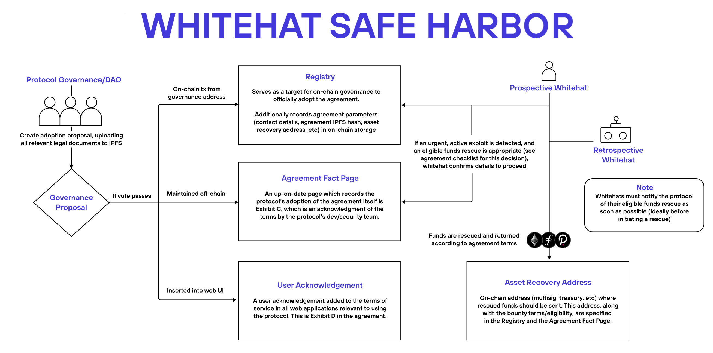

<p align="center">
  
</p>

# SEAL Whitehat Safe Harbor Agreement

The Whitehat Safe Harbor initiative is a framework in which protocols can offer legal protection to whitehats who aid in the recovery of assets during an active exploit.

## What's in this repo?

-   [documents/agreement.pdf](documents/agreement.pdf) - the key legal document that defines the framework.
-   [documents/summary.pdf](documents/summary.pdf) - a helper document that summarizes the official agreement.
-   [documents/FAQ.md](documents/FAQ.md) - answers to common questions about SEAL Safe Harbor.
-   [registry-contracts/](registry-contracts/) - the smart contracts that on-chain governance can use to signal their official adoption of the agreement.
-   [releases](https://github.com/security-alliance/safe-harbor/releases) - release changelog for different versions of the seal whitehat safe harbor agreement.


## V3 Contract Addresses

V3 contracts are deployed via [CreateX](https://github.com/pcaversaccio/createx) with deterministic addresses across all chains.

| Contract | Address | Description |
| -------- | ------- | ----------- |
| SafeHarborRegistry | [0x326733493E143b8904716E7A64A9f4fb6A185a2c](https://etherscan.io/address/0x326733493E143b8904716E7A64A9f4fb6A185a2c) | Main registry for protocol adoptions |
| ChainValidator | [0xd01C76ccE414d9B0a294abAFD94feD2e0B88675D](https://etherscan.io/address/0xd01C76ccE414d9B0a294abAFD94feD2e0B88675D) | Validates CAIP-2 chain IDs (upgradeable proxy) |
| AgreementFactory | [0xcf317fE605397bC3fae6DAD06331aE5154F277fF](https://etherscan.io/address/0xcf317fE605397bC3fae6DAD06331aE5154F277fF) | Factory for creating Agreement contracts |

> **Note:** These addresses are the same on all supported EVM chains due to CREATE3 deployment.

---

## Legacy Registry Addresses (V1/V1.1)

<details>
<summary>Click to expand legacy addresses</summary>

### Registry Addresses

| Chain         | Address                                                                                                                          | Version |
| ------------- | -------------------------------------------------------------------------------------------------------------------------------- | ------- |
| Ethereum      | [0x1eaCD100B0546E433fbf4d773109cAD482c34686](https://etherscan.io/address/0x1eaCD100B0546E433fbf4d773109cAD482c34686)            | 1.1     |
| BSC           | [0x1eaCD100B0546E433fbf4d773109cAD482c34686](https://bscscan.com/address/0x1eaCD100B0546E433fbf4d773109cAD482c34686)             | 1.1     |
| Polygon       | [0x1eaCD100B0546E433fbf4d773109cAD482c34686](https://polygonscan.com/address/0x1eaCD100B0546E433fbf4d773109cAD482c34686)         | 1.1     |
|               |                                                                                                                                  |         |
| Ethereum      | [0x8f72fcf695523A6FC7DD97EafDd7A083c386b7b6](https://etherscan.io/address/0x8f72fcf695523A6FC7DD97EafDd7A083c386b7b6)            | 1       |
| Polygon       | [0x8f72fcf695523A6FC7DD97EafDd7A083c386b7b6](https://polygonscan.com/address/0x8f72fcf695523A6FC7DD97EafDd7A083c386b7b6)         | 1       |
| Arbitrum      | [0x8f72fcf695523A6FC7DD97EafDd7A083c386b7b6](https://arbiscan.io/address/0x8f72fcf695523A6FC7DD97EafDd7A083c386b7b6)             | 1       |
| Optimism      | [0x8f72fcf695523A6FC7DD97EafDd7A083c386b7b6](https://optimistic.etherscan.io/address/0x8f72fcf695523A6FC7DD97EafDd7A083c386b7b6) | 1       |
| Base          | [0x8f72fcf695523A6FC7DD97EafDd7A083c386b7b6](https://basescan.org/address/0x8f72fcf695523A6FC7DD97EafDd7A083c386b7b6)            | 1       |
| Avalanche C   | [0x8f72fcf695523A6FC7DD97EafDd7A083c386b7b6](https://snowtrace.io/address/0x8f72fcf695523A6FC7DD97EafDd7A083c386b7b6)            | 1       |
| Polygon zkEVM | [0x8f72fcf695523A6FC7DD97EafDd7A083c386b7b6](https://zkevm.polygonscan.com/address/0x8f72fcf695523A6FC7DD97EafDd7A083c386b7b6)   | 1       |
| BSC           | [0x8f72fcf695523A6FC7DD97EafDd7A083c386b7b6](https://bscscan.com/address/0x8f72fcf695523a6fc7dd97eafdd7a083c386b7b6)             | 1       |
| Gnosis        | [0x8f72fcf695523A6FC7DD97EafDd7A083c386b7b6](https://gnosisscan.io/address/0x8f72fcf695523a6fc7dd97eafdd7a083c386b7b6)           | 1       |
| ZKsync        | [0x5f5eEc1a37F42883Df9DacdAb11985467F813877](https://explorer.zksync.io/address/0x5f5eEc1a37F42883Df9DacdAb11985467F813877)      | 1       |

### Factory Addresses

| Chain    | Address                                                                                                                  | Version |
| -------- | ------------------------------------------------------------------------------------------------------------------------ | ------- |
| Ethereum | [0x98D1594Ba4f2115f75392ac92A7e3C8A81C67Fed](https://etherscan.io/address/0x98D1594Ba4f2115f75392ac92A7e3C8A81C67Fed)    | 1.1     |
| BSC      | [0x98D1594Ba4f2115f75392ac92A7e3C8A81C67Fed](https://bscscan.com/address/0x98D1594Ba4f2115f75392ac92A7e3C8A81C67Fed)     | 1.1     |
| Polygon  | [0x98D1594Ba4f2115f75392ac92A7e3C8A81C67Fed](https://polygonscan.com/address/0x98D1594Ba4f2115f75392ac92A7e3C8A81C67Fed) | 1.1     |

</details>

## How does it work?

The Safe Harbor initiative is a preemptive security measure for protocols, similar to a bug bounty. It is a framework specifically for _active exploits_, i.e. situations where a vulnerability has begun to be exploited by a malicious actor. If a protocol has adopted Safe Harbor before such an incident occurs, whitehats will have clarity on how to act in a potential rescue, and will be more likely to help intervene.

### Protocol adoption

If a protocol has reviewed the agreement, weighed its pros and cons, and is interested in proceeding with adoption, a few steps are required.

Firstly, a decision must be made regarding the agreement's terms, including:

-   Which assets are in-scope for the agreement (e.g. any ERC20 token at a specific address)?
-   What reward will be given to successful whitehat rescues (e.g. 10% of rescued funds capped at $1m)?
-   Where should rescued funds be returned (e.g. a specific multisig or treasury address)?

Once the specifics are determined, a governance proposal should be created for voting on the adoption of Safe Harbor. Exhibit B of the agreement provides details on how this proposal should be structured. For transparency and future on-chain referencing, all relevant documents should be uploaded to IPFS at this stage. If the protocol doesn't have an official on-chain voting procedure, alternative methods can be explored to engage the community in the decision-making process.

If the decision to adopt Safe Harbor becomes official, there are three final steps for adoption:

-   An "Agreement Fact Page" must be created by the protocol. This provides all information about the protocol's adoption of the agreement, and must be maintained off-chain for anyone to view.
-   The "User Adoption Procedures" (Exhibit D of the agreement) must be adapted and inserted into the protocol website's terms-of-service.
-   A governance address must send an on-chain transaction to the Safe Harbor registry contract. This is the legally binding action, so the address calling the registry should represent the decision-making authority of the protocol.

### Whitehat adoption

If a whitehat reads and understands the entire legal framework, they may later be eligible to participate in a whitehat rescue. These rescues should only be taken in very specific circumstances, and it is important to reiterate the following:

-   The framework only applies to _active exploits_, and it is a violation of the agreement if the whitehat initiates an exploit themselves.
-   The protocol is not responsible for ensuring the whitehat follows the law, and the whitehat can not be protected from criminal charges outside the agreement's scope.
-   There are nuances that can affect the agreement's enforceability, and whitehats will assume many legal risks by becoming involved.

If the whitehat decides to proceed with a whitehat rescue, they must follow the process specified in the agreement. This includes transferring rescued funds to the protocol's "Asset Recovery Address" and promptly notifying the protocol of the fund recovery. The whitehat may keep (or later receive) a reward, based on the terms of the agreement.

## Diagram



## How to Adopt Safe Harbor

To find out more information about adopting Safe Harbor, please check out the [Safe Harbor SEAL Framework](https://frameworks.securityalliance.org/safe-harbor/index.html). Or reach out to us at [safe-harbor@securityalliance.org](mailto:safe-harbor@securityalliance.org).

# Tests

## Unit
```bash
forge test
```

## Integration

```bash
# set your MAINNET_RPC_URL and POLYGON_RPC_URL environment variables
# then run:
FOUNDRY_PROFILE=integration forge test
```

## Fork

All tests are compatible to run against a forked environment.

```bash
forge test --fork-url $MAINNET_RPC_URL
```


# Solana programs 
To clone repo with solana programs 
```bash
$ git clone git@github.com:security-alliance/safe-harbor.git
$ cd safe-harbor
$ git submodule update --init --recursive
```

or 

```sh
$ git clone --recursive git@github.com:security-alliance/safe-harbor.git
```


# Acknowledgements
- [Cyfrin](https://www.cyfrin.io/) and [patrickalphac](https://x.com/PatrickAlphaC) for helping create V3 of Safe Harbor and conducting the [security audit](https://github.com/Cyfrin/cyfrin-audit-reports/blob/main/reports/2026-01-13-cyfrin-safe-harbor-v2.0.pdf).
- [OtterSec](https://osec.io/) for their Solana Safe Harbor implementation.